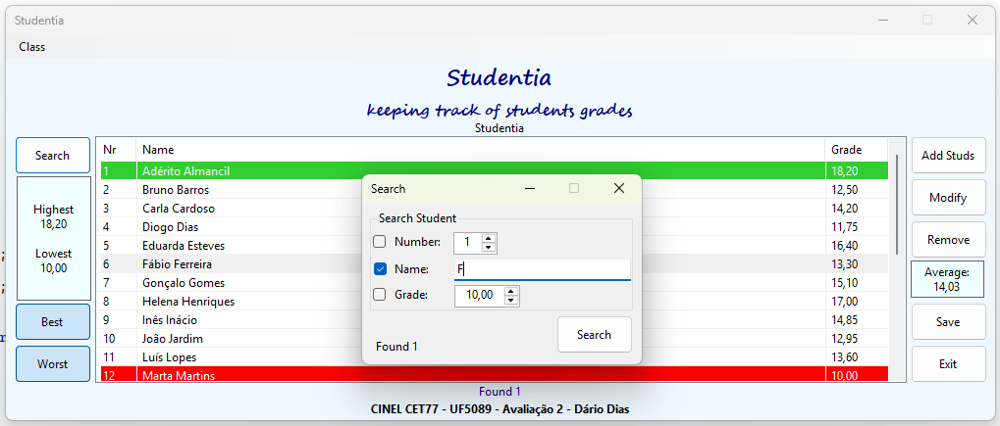

# Studentia

**Studentia** is a Windows Forms application built in C# simulating basic managemenet and tracking students' grades.

This is the second of two evaluation projects for a professional training course module on WinForms.

---

## Main Entity

### 🧑‍🎓 `Student`:

```csharp
public struct Student
{
    public int Number { get; set; }
    public string Name { get; set; }
    public float Grade { get; set; }
}
```

## Features

### 🗃️ CRUD

- ➕ Add new students
- ✏️ Modify existing student records
- ❌ Remove students from the list
- 🔄 Sort students by any field
- 🔍 Search students by any field

### 📊 Automatic statistics

- Highest grade
- Lowest grade
- Average grade

### 🎨 Highlight

- Best students (green)
- Worst students (red)

### 📂 File management

- Save / Save As
- Open existing class files
- Open default file
- Delete class files (with backup)

---

## Project Structure

### 💻 `Form1`

Main application window for:

- Displaying students in a `ListView`
- Managing file operations
- Handling UI interactions
- Performing sorting and statistics

### ⏹️ `FormInput`

Secondary form used for:

- Searching students
- Adding new students
- Modifying existing records

---

## Key Behaviors

#### 🔤 Sorting toggles between ascending and descending
#### 🖥️ UI dynamically adjusts (e.g., column width with scrollbar)
#### ✅ Unsaved changes trigger a prompt before closing or opening another file
#### 💾 Automatic backup is created before overwriting files

---

## Screenshots

#### Best, Worst and Found students highlighted


